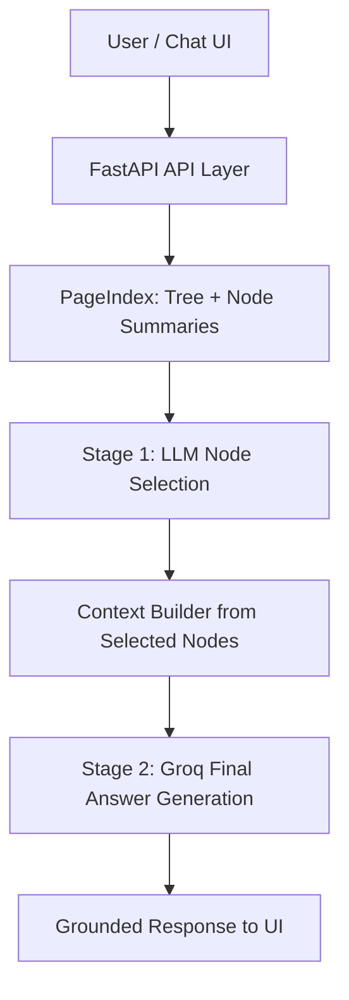

# Vectorless RAG System

A production-grade **Vectorless Retrieval-Augmented Generation (RAG) chatbot** built with **FastAPI, Groq, and PageIndex**, designed to deliver **grounded, document-aware responses without relying on traditional vector databases**.

This system implements a **tree-structured retrieval workflow** where the LLM first identifies the most relevant document nodes using structural summaries, then generates a final answer grounded in the retrieved content.

---

## Key Highlights

* Built a **vectorless document retrieval pipeline**
* Eliminated dependency on **FAISS / Pinecone / Chroma**
* Implemented **two-stage LLM reasoning and answer generation**
* Designed a **clean interactive chat UI**
* Supports **PDF upload, indexing, status tracking, and Q&A**
* Exposes **reasoning traces and retrieved node IDs**
* Built using **production-ready FastAPI architecture**

---

## Tech Stack

* **Backend:** FastAPI
* **LLM:** Groq
* **Document Retrieval:** PageIndex
* **Frontend:** HTML, CSS, JavaScript
* **Templating:** Jinja2
* **Environment Management:** python-dotenv

---

## API Key Setup

Create your API keys from the official dashboards:

* **PageIndex API Key:** https://dash.pageindex.ai/api-keys
* **Groq API Key:** https://console.groq.com/keys
* **PageIndex Docs (Getting Started):** https://docs.pageindex.ai/getting-started

Add both keys in your `.env` file:

```env
PAGEINDEX_API_KEY=your_pageindex_key_here
GROQ_API_KEY=your_groq_key_here
```

---

## Project Structure

```text
Vectorless-RAG/
├── page_index.py
├── templates/
│   └── index.html
├── static/
│   ├── style.css
│   └── app.js
├── .env.example
├── .gitignore
└── README.md
```

---

## Core Capabilities

### Document Upload & Indexing

* Upload PDF documents
* Submit documents to PageIndex
* Track processing status
* Validate readiness before querying

### Intelligent Retrieval Pipeline

* Fetch document tree summaries
* Perform structure-aware node selection
* Retrieve relevant node content
* Generate grounded final answers

### Explainable Responses

Each response includes:

* **Final answer**
* **LLM reasoning trace**
* **retrieved node IDs**

This improves transparency and debugging during evaluation.

---

## Architecture



**Flow Summary**

* Request enters through FastAPI
* PageIndex provides structured document tree data
* LLM selects relevant nodes (retrieval stage)
* System builds contextual evidence from selected nodes
* LLM generates final grounded answer (generation stage)
* UI receives answer with explainability fields

---

## Retrieval Workflow

### Stage 1 — Structural Retrieval

The system retrieves the **document tree and node summaries** from PageIndex.

Instead of embeddings, the LLM analyzes:

* node summaries
* hierarchical structure
* section relevance

to identify the most relevant nodes.

### Stage 2 — Grounded Answer Generation

Selected node content is assembled into a context window and passed to the LLM for final answer generation.

This ensures:

* reduced hallucination
* document-grounded responses
* explainable retrieval flow

---

## API Endpoints

### `POST /api/documents/upload`

Uploads a PDF and initiates indexing.

### `GET /api/documents/{doc_id}/status`

Checks whether indexing is complete.

### `POST /api/query`

Processes user query against indexed document.

---

## Sample Query Response

```json
{
  "doc_id": "pi-xxxxxxxx",
  "query": "Summarize the key policies",
  "thinking": "Selected relevant compliance sections",
  "node_list": ["node_2", "node_5"],
  "answer": "The key policies include..."
}
```

---

## Why This Stack?

Traditional RAG systems rely heavily on vector databases and embedding infrastructure.

This stack is chosen to keep the system simple, explainable, and production-ready:

* **FastAPI** for clean API design, async performance, and easy deployment
* **PageIndex** for structure-aware retrieval without external vector DB setup
* **Groq** for fast LLM inference in both retrieval and answer stages
* **Jinja2 + Vanilla JS UI** for lightweight frontend with low operational overhead
* **python-dotenv** for straightforward environment-based configuration

This combination reduces infrastructure complexity while preserving response quality and traceability.

---

## Production Enhancements

* streaming response support
* persistent session storage
* retry and backoff logic
* logging and observability
* rate limiting and auth
* HTTPS reverse proxy deployment

---

## Security Best Practices

* secrets stored in `.env`
* `.env` excluded from Git
* API key rotation supported
* safe production deployment ready

---

## Run Locally

```bash
uvicorn page_index:app --reload
```

Open:

```text
http://127.0.0.1:8000
```
